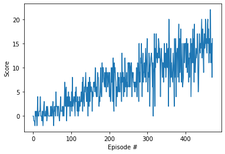

# Solving the bananas environment with Deep Q-Networks

## Overview

This report describes the implementation of a Basic Deep Q-Network (Basic DQN). The implementation is done in Python using PyTorch.

## Learning algorithm

The learning algorithm can be divided into two separate parts: the Q-Network itself ([model.py](model.py)) and the agent that uses it ([dqn_agent.py](dqn_agent.py)) along with the policy to update the network.

### Q-Network architecture ([model.py](model.py))

A Q-Network maps states to Q-values for each action. In this case, the architecture followed to solve the environment:

* Input: 37 nodes (`state_size`).
* Hidden layer 1: 64 nodes by default (`fc1_units`) with a ReLU activation.
* Hidden layer 2: 64 nodes by default (`fc2_units`) with a ReLU activation.
* Output layer: 4 nodes as for the number of possible actions (`action_size`).

### Agent ([dqn_agent.py](dqn_agent.py))

Since the agent is following a DQN architecture, it has two Q-Networks (`qnetwork_local`and `qnetwork_target`) as in the original implementation. The selected optimizer is Adam.

The agent has a replay buffer where it stores several experiences to learn from. When the replay buffer is big enough (>`BATCH_SIZE`), the agent performs the learning step, where it:

1. Gets the max predicted Q-values for next states from the target model
2. Computes Q targets for current states
3. Gets the expected Q-values from the local model
4. Computes and minimizes the loss 
5. Updates the target network with a soft update

The way the agent performs an action given an state from the environment depends on the epsilon-greedy algorithm: it would get a random choice when epsilon is big enough, but epsilon gets minimized at each episode so it's more probable that the agent selects a greedy action.

### Hyperparameters

| Hyperparameter | Value  | Description                                                  |
| -------------- | ------ | ------------------------------------------------------------ |
| `BUFFER_SIZE`  | 10000  | Maximum size of the experience replay buffer                 |
| `BATCH_SIZE`   | 64     | Number of experiences sampled in one batch to learn from     |
| `GAMMA`        | 0.99   | Discount factor for future rewards                           |
| `TAU`          | 0.001  | Controls the update of the target Q-Network from the online Q-Network |
| `LR`           | 0.0005 | Learning rate for the Q-Networks                             |
| `UPDATE_EVERY` | 4      | How often to update the network                              |
| `fc1_units`    | 64     | Size of the first hidden layer                               |
| `fc2_units`    | 64     | Size of the second hidden layer                              |
| `n_episodes`   | 2000   | Number of episodes                                           |
| `max_t`        | 1000   | Number of steps per episode                                  |
| `eps_start`    | 1      | Start value for the epsilon parameter in the epsilon-greedy strategy |
| `eps_end`      | 0.01   | End value for the epsilon parameter in the epsilon-greedy strategy |
| `eps_decay`    | 0.995  | Decrease of the epsilon parameter in the epsilon-greedy strategy |

## Results

The agent was able to learn how to solve the environment. In particular, you can see in the following plot how it could achieve that:

The environment is solved when the agent is able to get an average score of +13 over 100 consecutive episodes. In this case, the agent solved the environment after 471 episodes.

## Future work

Since this is just the first version for solving the environment, several actions can be made to improve this project:

1. Fist of all, performing a grid search for the hyperparameters, so the agent is able to solve the environment as fast as possible.
2. Implement other extensions of Deep Q-Networks. In particular, the idea is to compare different implementations, such as:
   * N-step DQN.
   * Double DQN.
   * Noisy networks.
   * Prioritized replay buffer.
   * Dueling DQN.
   * Categorical DQN.
   * Rainbow (or combining everything).
3. Solve the environment taking the images instead of the memory array from the environment so one can compare what is the best approach and the different difficulties that arise with every approach.